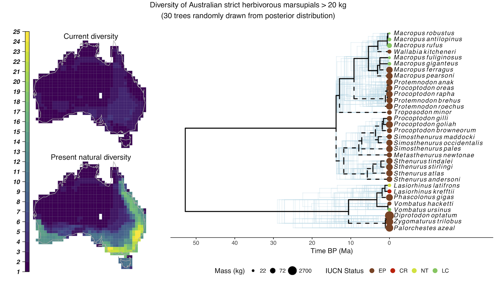

<!-- README.md is generated from README.Rmd in docs. Please edit that file -->


Welcome to the repo for PHYLACINE, a global database for late Quaternary mammals.
=================================================================================

PHYLACINE is a database that features: 
* Trait data (mass, diet, life habit) 
* Island endemicity 
* IUCN threat status 
* Phylogenetic trees 
* Current ranges 
* Counterfactual present natural ranges

    ...for all extant and recently extinct mammal species (~130,000 years ago until today).


### Download the data
To download the latest stable version of PHYLACINE (Version 1.2) or to read our detailed metadata, vist our archive on [DataDryad](www.datadryad.org) **(This link will go live once the manuscript has been published)**.

To play around with the latest development version of PHYLACINE, fork our repo or click [here](https://minhaskamal.github.io/DownGit/#/home?url=https://github.com/MegaPast2Future/PHYLACINE_1.2/tree/master/Data).


### Cite the data
To cite PHYLACINE, please use the following:

> Faurby, S., Davis, M., Pedersen, R. Ø., Schowanek, S. D., Antonelli, A., & Svenning, J.C. (In Press). PHYLACINE 1.2: The Phylogenetic Atlas of Mammal Macroecology. Ecology.

If you would like high resolution copies of the PHYLACINE logo for your presentations, we have both a [colored version](docs/PHYLACINE_logo_large.png) and a [black and white version](docs/PHYLACINE_logo_large_bw.png) that you may use.


### Report errors
If you have an error to report or a suggestion to improve the database, please contact us through this [form](https://docs.google.com/forms/d/e/1FAIpQLSeo0vEbt7IO6DV0FXLt8wzgXVXEcw2lYHzJeItbA_CiM-PjSw/viewform?usp=sf_link) or start a pull request.

### Check out our Most Wanted List
You can also help us out by taking a look at our [Most Wanted List](docs/Most_wanted_list.csv) of species with missing data. Recognize any names and know where we could find data about their diet or body mass? Please drop us a [line](https://docs.google.com/forms/d/e/1FAIpQLSeo0vEbt7IO6DV0FXLt8wzgXVXEcw2lYHzJeItbA_CiM-PjSw/viewform?usp=sf_link). Species with large ranges and imprecise phylogenetic imputations are ranked highest.

### Road map
Here are some changes we are planning to make in future versions of PHYLACINE:

#### Species to remove:
* _Navahoceros fricki_
* _Sangamona fugitiva_
* _Hexaprotodon sivalensis_
* _Sus brachgnathus_
* _Stegodon trigonocephalus_
* _Bubalus palaeokerabau_

#### Species to add:
* _Stegodon sumbaensis_
* _Milimonggamys juliae_
* _Raksasamys tikusbesar_

#### Changes in taxonomy:
* _Glyptotherium floridanum_ -> _Glyptotherium cylindricum_

------------------------------------------------------------------------

PHYLACINE 1.2 is a product of MegaPast2Future, a multidisciplinary, international working group housed at Aarhus University in Denmark. If you would like to know more about us, visit our [main page](http://projects.au.dk/mega/). If you are interested in other work we are doing on GitHub, check out our [GitHub site](https://megapast2future.github.io).

------------------------------------------------------------------------

Vignette
--------

Try out this small vignette to get sense for the kind of data in PHYLACINE and the things you can do with it. You'll produce maps and phylogenetic trees of Australian megafauna.

First, you'll need to download the PHYLACINE database (see above). Then, make sure your working directory in R is set to the directory enclosing the "Data" folder (If you downloaded the stable version of PHYLACINE from DataDryad, you'll have a slightly different folder structure, so just make sure your edit the relative file paths in the code below to reflect where your own file structure).

Now install all the packages needed to run this vignette (pacman helps out with this as we need so many packages).

``` r
install.packages("pacman", repos="https://cloud.r-project.org")
pacman::p_load(ggplot2,
               dplyr,
               stringr,
               gridExtra,
               viridisLite,
               raster,
               rasterVis,
               rgdal,
               maptools,
               ape,
               ggtree, update = F)
```

Load up the phylogeny (this takes about 30 seconds). To make this example easy to run we will only use 30 out of the 1000 available trees. Remember to always use a distribution of trees like this to capture phylogenetic uncertainty.

``` r
forest <- read.nexus("Data/Phylogenies/Complete_phylogeny.nex")
names(forest) <- NULL
set.seed(42)
forest <- forest[sample(1:1000, 30)]
```

Now load up the rest of the data.

``` r
# Load world map and subset to Australia
data(wrld_simpl)
australia <- wrld_simpl[wrld_simpl$NAME == "Australia", ]

# Load trait data. Remember to always use UTF-8 encoding with PHYLACINE files to avoid weird characters 
mam <- read.csv("Data/Traits/Trait_data.csv", fileEncoding = "UTF-8", stringsAsFactors = F)

# Set factor levels for IUCN status. "EP" is a new status we added to designate species that went extinct in prehistory like Diprotodon  
mam$IUCN.Status.1.2 <- factor(mam$IUCN.Status.1.2, levels=c("EP", "EX", "EW", "CR", "EN", "VU", "NT", "LC", "DD"))

# Subset to species that are in Australian marsupial orders, over 20 kg, and over 90 % herbivorous
marsupial.orders <- c("Dasyuromorphia", "Peramelemorphia",
                      "Notoryctemorphia", "Diprotodontia")
marsupials <- mam[mam$Order.1.2 %in% marsupial.orders, ]
marsupials <- marsupials[marsupials$Mass.g > 20000, ]
marsupials <- marsupials[marsupials$Diet.Plant >= 90, ]
```

Current maps show where species live today. Present natural maps represent a counterfactual scenario that shows where species would live without Anthropogenic pressures. These ranges include extinct species.

``` r
# Load maps of these marsupial species
maps.current <- paste0("Data/Ranges/Current/", marsupials$Binomial.1.2, ".tif")
r.current <- stack(maps.current)
maps.pres.nat <- paste0("Data/Ranges/Present_natural/", marsupials$Binomial.1.2, ".tif")
r.pres.nat <- stack(maps.pres.nat)

# Project Australia map to the range map projection
australia <- spTransform(australia, crs(r.current))

# Crop range maps to just the extent of Australia for a cleaner plot
ext <- extent(australia)
ext[2] <- 15000000 # Reduce eastern extent
ext[3] <- -5200000 # Reduce southern extent
ext[4] <- -1370000 # Reduce northern extent
r.current <- crop(r.current, ext)
r.pres.nat <- crop(r.pres.nat, ext)

# Create a blank raster of the region
blank.r <- r.current[[1]]
blank.r[] <- NA
names(blank.r) <- NA

# Load all the current raster data into a matrix for faster handling
m.current <- matrix(NA, nrow=nrow(marsupials), ncol=dim(r.current)[1]*dim(r.current)[2])
rownames(m.current) <- marsupials$Binomial.1.2
for(i in 1:nrow(marsupials)) {
  m.current[i, ] <- getValues(r.current[[i]])
}
# Current species list
sp.current <- marsupials$Binomial.1.2[rowSums(m.current) > 0]

# Load all the present natural raster data into a matrix for faster handling
m.pres.nat <- matrix(NA, nrow=nrow(marsupials), ncol=dim(r.current)[1]*dim(r.current)[2])
rownames(m.pres.nat) <- marsupials$Binomial.1.2
for(i in 1:nrow(marsupials)) {
  m.pres.nat[i, ] <- getValues(r.pres.nat[[i]])
}
# Present natural species list
sp.pres.nat <- marsupials$Binomial.1.2[rowSums(m.pres.nat) > 0]

# Create rasters of taxonomic richness
current.div <- blank.r
current.div[] <- colSums(m.current)
names(current.div) <- "Current diversity"
pres.nat.div <- blank.r
pres.nat.div[] <- colSums(m.pres.nat)
names(pres.nat.div) <- "Present natural diversity"
div <- stack(current.div, pres.nat.div)
# Change 0 to NA, for nicer plotting
div[] <- ifelse(div[] == 0, NA, div[])
```

Set up the ranges for plotting.

``` r
# Plot the two maps on top of each other, with a nice legend
p.map <- 
  levelplot(div,
          layout = c(1,2),
          colorkey=list(
            space='left',                   
            labels=list(at = 1:max(div[], na.rm = T), font=4),
            axis.line=list(col = 'black'),
            width=0.75
          ),
          par.settings = list(
            strip.border = list(col='transparent'),
            strip.background = list(col='transparent'),
            axis.line = list(col = 'transparent')
          ),
          scales = list(draw = FALSE),            
          col.regions = viridis,                   
          at = 1:max(div[], na.rm = T),
          names.attr = str_replace_all(names(div), "\\.", " "))

# Add Australia polygon outline
p.map <- p.map + layer(sp.polygons(australia, col = "darkgrey"))
```

Trim the phylogenies down to just the Australian megafauna we are looking at and prepare them for plotting. We plot a random tree as the focal tree and then 29 other trees behind it to show uncertainty.

``` r
# Trim tree down to the species list of Australian marsupials created earlier
pruned.forest <- lapply(forest, 
                          function(x) {
                            drop.tip(x, x$tip.label[!x$tip.label %in% sp.pres.nat])
                          }
                        )
class(pruned.forest) <- "multiPhylo"

# Pick a single tree for overplotting and labelling
tree <- pruned.forest[[1]]
# Group tree by extant species for marking them later
tree <- groupOTU(tree, tree$tip.label %in% sp.current)
# Turn tree to dataframe
tree <- fortify(tree)
# Add trait info
tree <- left_join(tree, marsupials, by = c("label" = "Binomial.1.2"))
# Reverse age scale
tree$x <- tree$x - max(tree$x)

# Prepare mass based legend
mass.breaks <- marsupials$Mass.g/1000
mass.breaks <- ceiling(c(min(mass.breaks), median(mass.breaks), max(mass.breaks)))

# Prepare IUCN status color legend. We use a modified version of IUCN's official color palette
status.colors <- c("EP" = "#87421F", "EX" = "#8F47B3", "EW" = "#8F47B3", 
                   "CR" = "#D81E05", "EN" = "#FC7F3F", "VU" = "#F9E814", 
                   "NT" = "#CCE226", "LC" = "#60C659", "DD" = "#D1D1C6")

# Convert multiPhylo to data.frame
pruned.forest <- fortify(pruned.forest)
# Reverse ages to show time BP
pruned.forest$x <- pruned.forest$x - max(pruned.forest$x)

# Plot forest of uncertainty (based on only 30 out of 1000 trees for speed)
p.tree <- ggplot(pruned.forest) +
  geom_tree(col = "lightblue", alpha = .3, multiPhylo = TRUE) +
  theme_tree2() +
  scale_x_continuous("Time BP (Ma)",
                     limits = c(min(tree$x), 23), breaks = seq(-50, 0, 10),
                     label = abs(seq(-50, 0, 10)))

# Overlay a plot of a single tree with more info
p.tree <- p.tree + 
  geom_tree(data = tree, aes(x, y, lty = group), size = .8) +
  geom_tiplab(data = tree, aes(label = paste0('italic(', str_replace(label, "_", "~"), ')')),
              offset = .8, parse = T, size= 3.5) +
  scale_linetype_manual(values = c("dashed", "solid"), guide = F) +
  geom_tippoint(data = tree, aes(x, y, color = IUCN.Status.1.2, size = Mass.g/1000)) +
  scale_color_manual("IUCN Status",
                     values = status.colors) +
  guides(color = guide_legend(override.aes = list(size = 3))) +
  theme(legend.position = "bottom",
        legend.box = "horizontal",
        panel.background = element_blank(),
        axis.line.x = element_line()) +
  scale_size_continuous("Mass (kg)",
                        breaks = mass.breaks,
                        trans = "log10")
```

Finally, put everything together into one big plot and save it.

``` r
# Plot it all
p <- arrangeGrob(
  p.map, p.tree,
  widths = c(1, 2),
  layout_matrix = rbind(c(1, 2)),
  top = "Diversity of Australian strict herbivorous marsupials > 20 kg\n(30 trees randomly drawn from posterior distribution)"
  )

# If you just want to print the plot without saving it, you can use grid.arrange(p)
ggsave("Australian_megafauna.pdf", plot = p, units = "cm", width = 28, height = 16)
```

You should end up with something like this. Current diversity shows how many megafauna live in Australia now but Present natural diversity shows where extinct megafauna could live today. The dotted lines on the tree mark out branches that we have lost to extinction. You can see they are connected to the largest species.




  This work is licensed under a <a rel="license" href="http://creativecommons.org/publicdomain/zero/1.0/">Creative Commons 0 License</a>.
